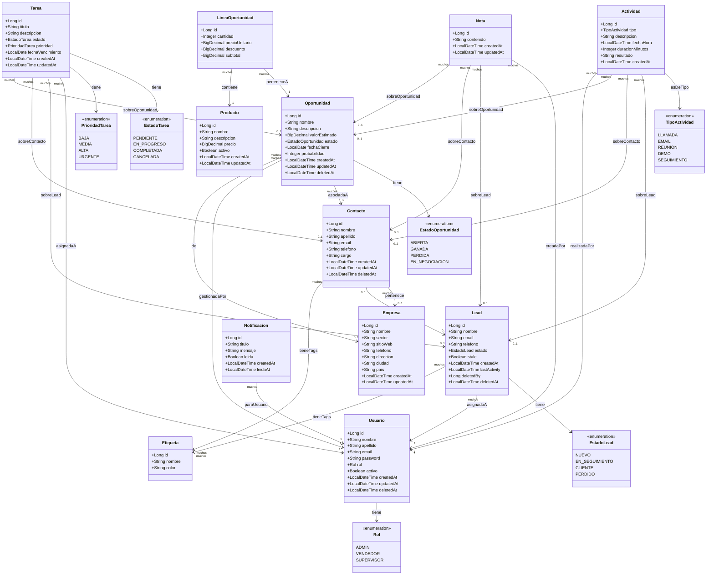

# Diagrama de Clases — Backend CRM NoCountry

---

## Descripción de entidades

| Entidad | Descripción |
|---|---|
| **Usuario** | Empleado del sistema (vendedor, supervisor o admin). Gestiona leads, contactos, tareas y oportunidades. |
| **Rol** | Enum de roles de usuario: `ADMIN`, `VENDEDOR`, `SUPERVISOR`. |
| **Lead** | Prospecto o cliente potencial. Estado inicial del funnel de ventas. Puede convertirse en `Contacto`. |
| **EstadoLead** | Enum del ciclo de vida de un lead: `NUEVO → EN_SEGUIMIENTO → CLIENTE / PERDIDO`. |
| **Empresa** | Organización o compañía a la que pertenecen los contactos. |
| **Contacto** | Lead convertido con información detallada. Puede estar vinculado a una `Empresa`. |
| **Oportunidad** | Posibilidad de venta asociada a un contacto. Contiene valor estimado y probabilidad de cierre. |
| **EstadoOportunidad** | Enum del ciclo de vida de una oportunidad: `ABIERTA`, `EN_NEGOCIACION`, `GANADA`, `PERDIDA`. |
| **Producto** | Bien o servicio del catálogo que se puede incluir en oportunidades. |
| **LineaOportunidad** | Relación entre `Oportunidad` y `Producto` con cantidad, precio y descuento. |
| **Actividad** | Interacción registrada (llamada, email, reunión) sobre un lead, contacto u oportunidad. |
| **TipoActividad** | Enum del tipo de actividad: `LLAMADA`, `EMAIL`, `REUNION`, `DEMO`, `SEGUIMIENTO`. |
| **Tarea** | Acción pendiente asignada a un usuario, relacionada con un lead, contacto u oportunidad. |
| **EstadoTarea** | Enum del estado de una tarea: `PENDIENTE`, `EN_PROGRESO`, `COMPLETADA`, `CANCELADA`. |
| **PrioridadTarea** | Enum de prioridad: `BAJA`, `MEDIA`, `ALTA`, `URGENTE`. |
| **Nota** | Anotación libre sobre un lead, contacto u oportunidad, creada por un usuario. |
| **Notificacion** | Aviso interno generado por el sistema y dirigido a un usuario. |
| **Etiqueta** | Etiqueta/tag reutilizable para clasificar leads y contactos. |
